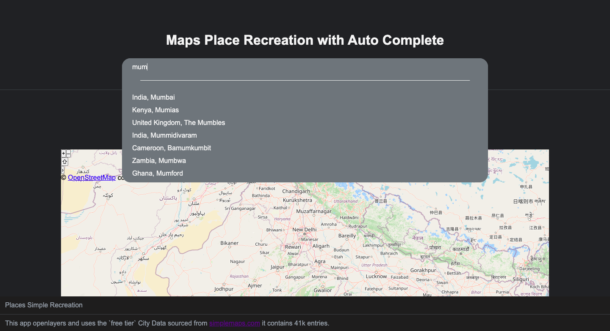

#  Map Places Search function in React

This app recreates map location search functionality in openlayers and react using location data from simplemaps.com

NB: This is a crude but very simple way to work with data. In production I would suggest creating api to process and serve the data and also consider using and database. 

